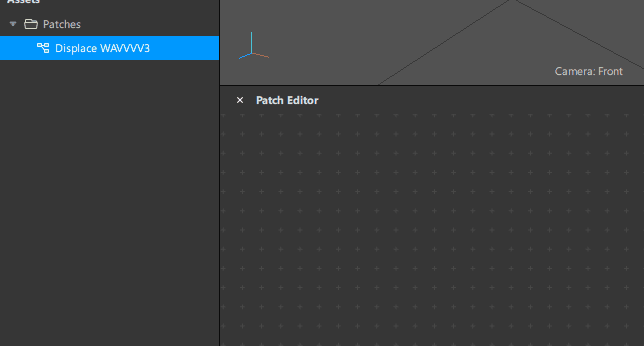
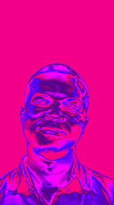
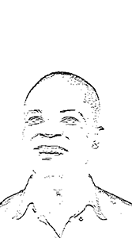
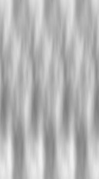
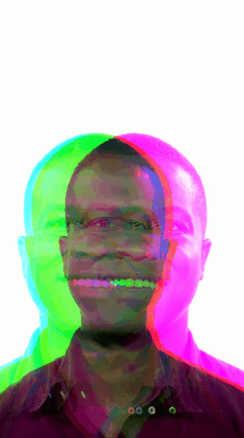

# SPARK FJ 
#### collab con [@ailaviu](https://instagram.com/ailaviu), efectos(patchs) para usar en SPARK AR, muy vj like aka fj
## ✌️

### !

**Para la versión 88 en adelante**
 
Hay un **BUG** en Spark Ar, que no permite guardar los valores en los parametros de los patchs, la solución a esto, es una vez que arrastramos el patch en el Node Editor, hacemos click derecho y seleccionamos *"Convert to Patch Group"*

  

