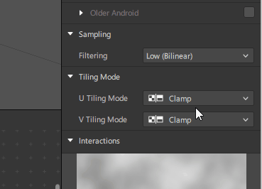
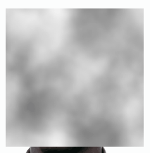
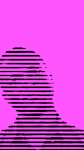

# SPARK FJ 
#### collab con [@ailaviu](https://instagram.com/ailaviu), efectos(patchs) para usar en SPARK AR, muy vj like aka fj
## ✌️

#### Para la versión 88 en adelante**

Hay algunos ejemplos para los patchs mas complejos

## ⚠️

**ScrollTexture**

Este patch es para scrollear texturas y generar mapas, para esto es necesario que la resolución sea potencia de 2:  
*128x128, 256x256, 512x512*  
   
Luego este setting en Spark AR

Mejor si es una textura que loopea en los bordes

### SAMPLES

*

###### MCCWN